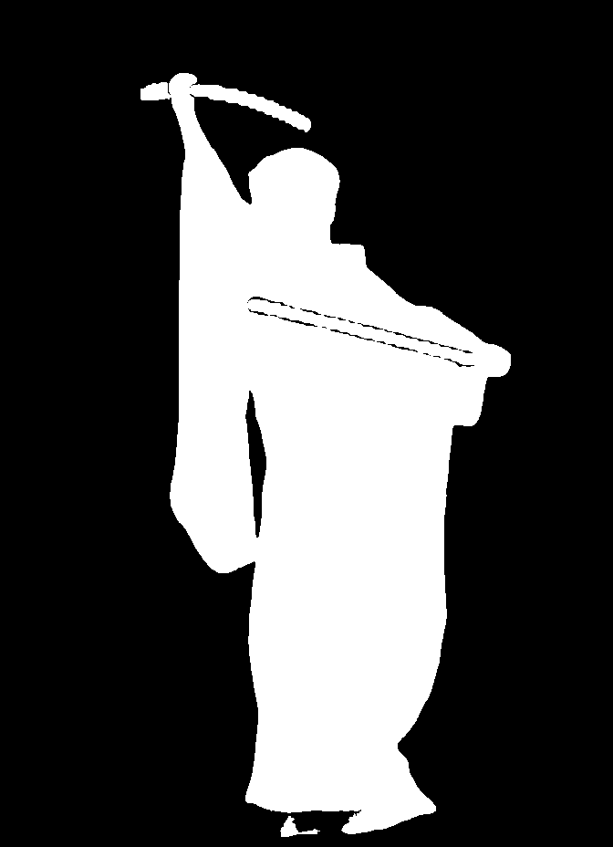
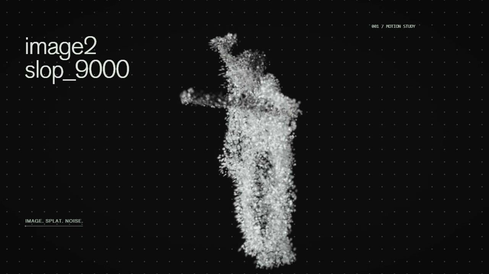

# image2slop_9000

image → video → SAM3 → splat → effects.

SAM3 cut. splat come out. music make wiggle. camera fly. export movie.

| image / frame | SAM3 mask | splat |
| :--- | :--- | :--- |
|  |  |  |

effects. click for movie.

app.

windows. python 3.11. node 22.12+. ffmpeg.
`SETUP.cmd` → fix tool paths in `pipeline.json` → `START-WEBAPP.cmd`.

own PLY? drop in. want image → splat? bring local ComfyUI + MiniMax, COLMAP, Brush, SAM3 weights.

[more words](STUDIO.md) · [movie](docs/media/demo.mp4)
