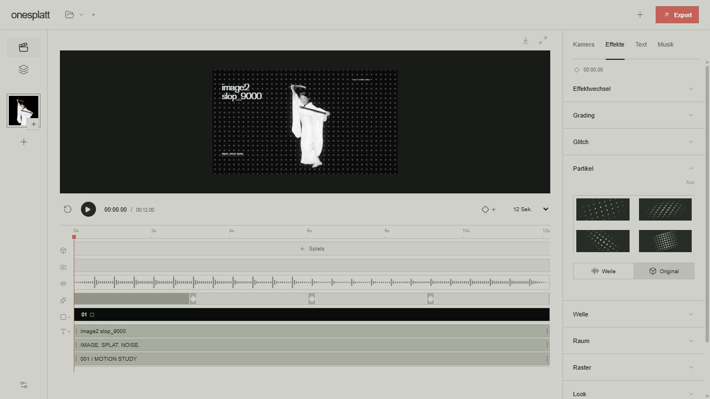

# image2slop_9000

image go in. video go round. splat come out.
music make wiggle. camera fly. text sit. export movie.

windows. python 3.11. node 22.12+. ffmpeg.
`SETUP.cmd` → fix tool paths in `pipeline.json` → `START-WEBAPP.cmd`.

own PLY? drop in. want image → splat? bring local ComfyUI + MiniMax, COLMAP, Brush, SAM3 weights.

[more words](STUDIO.md) · [movie](docs/media/demo.mp4)
